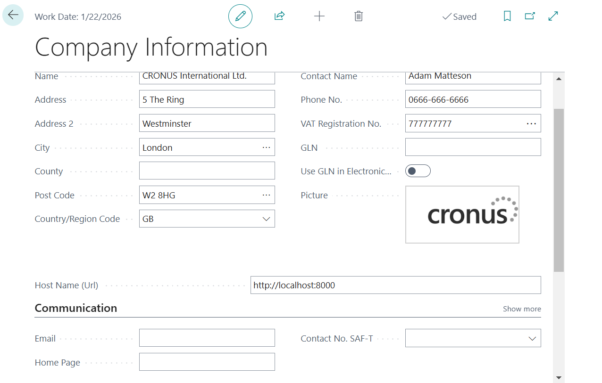
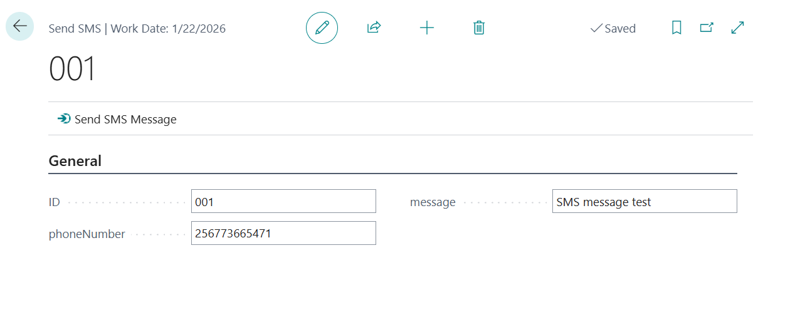

```markdown
# SMS API Connect

This is a simple Express Executable application that sends a basic HTML response when accessed via the root route (`/`).

## Prerequisites

Before getting started, ensure you have the following installed on your machine:

- **Node.js**: Version 14 or higher (download it from [here](https://nodejs.org/))
- **npm**: Node's package manager (comes with Node.js)

## Getting Started

Follow these steps to create and run the project locally:

### 1. Create a New Project

1. Create a new directory for your project:
    ```bash
    mkdir first-express-app
    cd first-express-app
    ```

2. Initialize a new Node.js project:
    ```bash
    npm init -y
    ```
    This will generate a `package.json` file that includes basic project information.

### 2. Install Dependencies

Install Express and other necessary dependencies:
```bash
npm install express cors axios body-parser dotenv crypto-js prompt-sync cookie-parser nodemon
```

### 3. Run Your Application

To run the application, follow these steps:

1. Open a terminal or command prompt.
2. Navigate to the project directory:
    ```bash
    cd path/to/sms-api-connect
    ```

3. Start the server:
    ```bash
    node app.js
    ```

4. Open your browser and go to `http://localhost:8800` to see the page.

### 4. Create EXE File (Windows Executable)

**Note:** If you're using Node.js 19 or higher, consider downgrading your Node.js version to 18 or below for compatibility.

1. Install `pkg`, a tool to create executables from Node.js apps:
    ```bash
    npm install -g pkg
    ```

2. Build the executable for all platforms (Windows, Linux, and macOS):
    ```bash
    pkg . --output .\pkg\sms-api.exe
    ```

3. To specify an output directory for your `.exe` file, use the following command:
    ```bash
    pkg . --output .\folder-name\app-name.exe
    ```

4. To build the `.exe` for Windows only and name the app `AppName.exe`:
    ```bash
    pkg app.js --targets win --output AppName.exe
    ```

5. **Add static files or assets in `pkg` configuration**  
    In `package.json`, include the assets:
    ```json
    "pkg": {
      "assets": [],
      "targets": ["host"],
      "outputPath": "pkg"
    }
    ```

### 5. Install Your App as a Service (Windows Service)

This allows your app to run as a service in the background, even if the editor is closed.

1. Download the [Windows Service Wrapper (WinSW)](https://github.com/winsw/winsw/releases) and copy the downloaded `.exe` to a folder for your project.

2. Create a folder for configurations (e.g., `sms-api-connect`) and include a `.xml` configuration file (e.g., `sms-api-connect.xml`) to install your `.exe` app as a Windows service. Below is an example configuration:
NB: Both the window service wrapper file name and xml file name should be the same
    ```xml
    <service>
      <id>sms-api-connect</id>
      <name>sms-api-connect</name>
      <description>sms-api-connect</description>
      <env name="EXE_SERVICE_APP_HOME" value="%BASE%"/>
      <env name="EXE_SERVICE_APP_APPDATA_PATH" value="%ALLUSERSPROFILE%\sms-api-connect\"/>
      <env name="EXE_SERVICE_APP_LOGS_PATH" value="%ALLUSERSPROFILE%\sms-api-connect\logs"/>
      <env name="EXE_SERVICE_APP_CONFIG_PATH" value="%ALLUSERSPROFILE%\sms-api-connect\config"/>
      <env name="EXE_SERVICE_APP_HTTP_PORT" value="8800"/>
      <env name="EXE_SERVICE_APP_HTTPS_PORT" value="9000"/>
      <env name="NODE_ENV" value="production"/>
      <executable>%BASE%\sms-api.exe</executable>
      <arguments>start</arguments>
      <startmode>Automatic</startmode>
      <logpath>%ALLUSERSPROFILE%\sms-api-connect\logs</logpath>
      <log mode="roll-by-size-time">
        <sizeThreshold>10240</sizeThreshold>
        <pattern>yyyyMMddHHmmss</pattern>
        <autoRollAtTime>00:00:00</autoRollAtTime>
      </log>
    </service>
    ```

    > Log files will be stored in the `ProgramData` folder.

3. Install [Inno Setup](https://jrsoftware.org/isinfo.php) and create an installer for your app using the following script. Save this script as `installer.iss`:
    ```ini
    [Setup]
    AppName=sms-api-connect
    AppVersion=1.0.0
    WizardStyle=modern
    AppPublisher=mike
    DefaultDirName={commonpf}\sms-api-connect
    DefaultGroupName=sms-api-connect
    PrivilegesRequired=admin
    Compression=lzma2
    SolidCompression=yes
    ArchitecturesAllowed=x64compatible
    ArchitecturesInstallIn64BitMode=x64compatible

    [Files]
    Source: "D:\Training\APIs\Executables EXE Files\sms-api-connect\pkg\sms-api.exe"; DestDir: "{app}"; Flags: ignoreversion
    Source: "D:\Training\APIs\Executables EXE Files\sms-api-connect\pkg\sms-api-connect.exe"; DestDir: "{app}"; Flags: ignoreversion
    Source: "D:\Training\APIs\Executables EXE Files\sms-api-connect\pkg\sms-api-connect.xml"; DestDir: "{app}"; Flags: ignoreversion

    [Run]
    Filename: "{app}\sms-api-connect.exe"; Parameters: "install"; Flags: postinstall hidewizard runhidden

    [UninstallRun]
    Filename: "{app}\sms-api-connect.exe"; Parameters: "uninstall"; Flags: runhidden
    ```

4. Compile the script using Inno Setup and generate an installer `.exe`.

5. Run the generated installer `.exe` to install your app as a service on Windows.

6. Go to the directory of ProgramData file created then open in command propt and type name of file.exe
C:\Program Files\sms-api-connect> sms-api.exe --config
Enter the path for your API key file:
Enter Url:

---

## Libraries Used

- `fs` module: For reading and writing files
- `prompt-sync`: For getting input from the command line
- `axios`: For interacting with Infobip SMS API
- `pkg`: For building the executable file
- `inno setup`: For creating the Windows executable file
- `nodemon`: For continuous running of the app during development

---

## Functionality Overview

- **API Key**: Read from a command line file upload
- **API Password**: Read from a command line text input
- **Encryption and Decryption**: Handled within the app

## Important Notes
1. While developing use __dirname to refer to the current working directory
2. While in production (Packaging your app into executable) change path to write to C://PrigramData that is where Windows allows to write 
We write to Program Data. Go here and create a folder
const configFilePath = path.join("C:", "ProgramData", "sms-api-connect", "config", "config.txt");

## Testing the API
1. Using Postman
Run the executable to start the service in executables folder

Go to directory where sms-api is installed in program files and run sms-api.exe --config in command prompt and close it

// Check command line arguments
if (process.argv.includes("--config")) {
  setupConfiguration();
} else {
  startServer();
}

Type http://localhost:8800 GET request to see config
Then http://localhost:8800 POST to send SMS message

2. In Business Central
Check sms-api-bc extention and do the setup

Then go to Send SMS page


Success!!!!!!!!!!!!!
---
